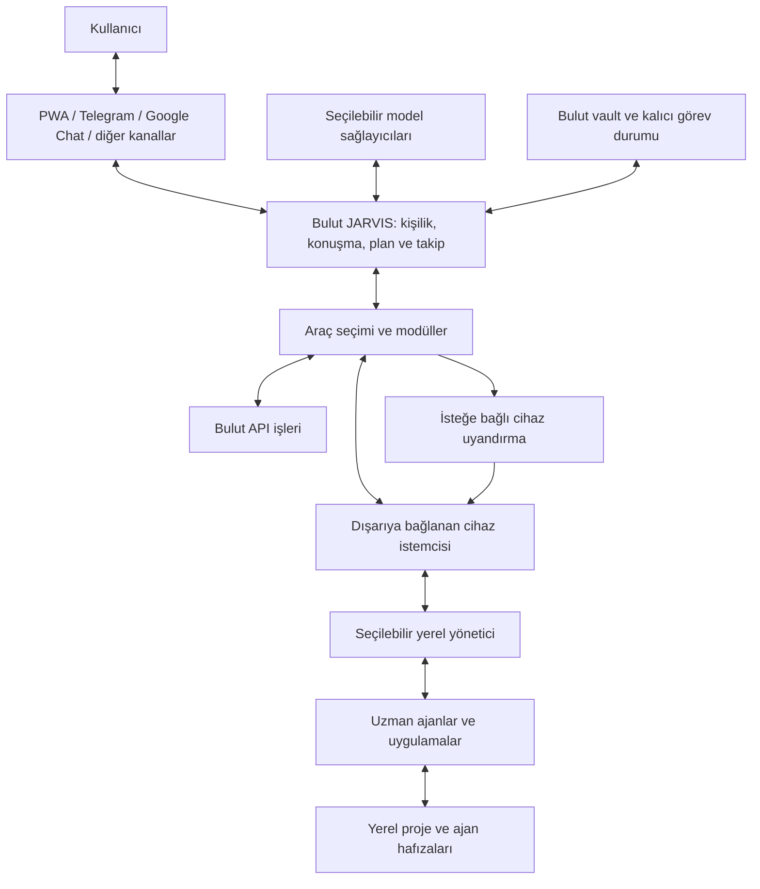

# JARVIS — modüler kişisel asistan mimarisi

Tarih: 2026-09-25. Durum: Kullanıcının yeni notlarına göre ürün ve mimari temelinin yeniden kurulması; uygulama henüz bu hedefi karşılamıyor.

Bu belge, 23–24 Eylül sadeleştirme ve harness planlarının **ürün yönünü ve teknoloji zorunluluklarını** değiştirir. Eski belgelerdeki tarihli deneyler kanıt olarak kalır; Hermes, Google Chat, Gemini veya CLIProxyAPI yeni ürünün zorunlu bileşenleri değildir. PWA kontrol paneli ve ses/görüntü yetenekleri ürün kapsamındadır. Kullanıcının mevcut Google aboneliği ilk kişisel kurulum tercihidir; başka kullanıcıların API veya başka sağlayıcı seçmesini engellemez.

Kaynak sırası: güncel kullanıcı talimatı → bu belge → kaynak koddan veya gerçek çalışmadan elde edilen tarihli kanıt → eski planlar. Bu değerlendirmede çalışma kodu, hesap bağlantısı veya canlı dağıtım değiştirilmedi. Hiçbir yeni entegrasyon çalışıyor kabul edilmedi.

## 1. Ürünün tanımı

JARVIS, ihtiyaç geldiğinde çalışan, kullanıcıyı zaman içinde tanıyan, bulutta kalıcı hafızası bulunan kişisel asistandır. Kullanıcı seçtiği istemciden konuşur. Asistan isteği anlar, ilgili hafızayı ve araçları seçer, yapabileceği günlük işleri bulutta tamamlar; cihaz gerektiren işleri uygun yerdeki yöneticiye devreder, gelişmeleri takip eder ve sonucu tercih edilen kanaldan ulaştırır.

Hem **birden fazla model sağlayıcısı** hem **metin, görsel, ses, video ve belge** desteklenebilir olmalıdır. Her modelin bütün biçimleri desteklediği varsayılmaz. Konuşma modeli, görsel üretimi, ses çözümleme ve ses üretimi gerektiğinde farklı sağlayıcılardan seçilebilir.

Ürün tek kişinin hesabı, alan adı, PC'si, işletim sistemi veya Google Cloud projesine bağlı olmayacak. İlk kurulum kişisel/tek sahipli olabilir; açık kaynak olabilmek için zorunlu bir çok kiracılı SaaS kurulmaz. Başka bir kullanıcının temiz kurulum yapabilmesi ve kendi bağlantılarını GUI'den ayarlayabilmesi kabul şartıdır.

### Kullanıcı notlarının karşılığı

| Gereksinim | Tasarım karşılığı | Kabul kanıtı |
| --- | --- | --- |
| Her ortama uyarlanabilme | Taşınabilir çekirdek; bulut, depolama, işletim sistemi ve cihaz farkları adaptörlerde | Temiz ikinci kullanıcı kurulumu; ayrı dağıtım profili ve desteklenen ikinci işletim sistemi |
| Beyin değiştirilebilir | Model sağlayıcısı, kimlik doğrulama yolu ve yürütme motoru ayrı seçimler | Sağlayıcı değişince aynı konuşma, hafıza ve araç turu sürer |
| GUI ile yönetim | PWA kurulum ve kontrol paneli; sunucuda tek yapılandırma kaynağı | Ayar kaydedilir, yeniden başlatmadan sonra okunur ve gerçek bağlantı testi yapılır |
| Özel alan adı gerekmemesi | Barındırma sağlayıcısının HTTPS adresiyle kurulabilme | Kullanıcının satın aldığı alan adı olmadan PWA, giriş ve geri dönüş adresleri çalışır |
| Uyuyan kişisel asistan | Olayla uyanan bulut yürütmesi, kalıcı konuşma/görev/hafıza | PC kapalıyken gerçek bir model ve araç işi tamamlanır |
| Select tool | Yetkili araç kataloğunda arama, seçilen şemaların gerektiğinde yüklenmesi | Model isteğinde ilgisiz modüllerin tam araç şemaları bulunmaz |
| Bulutta vault | JARVIS hafızasının bulutta esas kaydı; sürümlü erişim ve taşınabilir dışa aktarma | PC kapalıyken okuma/yazma; yeniden başlatma ve çakışma deneyi |
| Topluluk modülleri | Sürümlü modül sözleşmesi, ayar şeması, yetenek ve sağlık bildirimi | Yeni modül çekirdek kodu değiştirilmeden eklenir ve kaldırılır |
| Akıllı ev ile cihaz açma | İsteğe bağlı güç sağlayıcısı; gerçek cihaz keşfi ve durum uzlaştırma | Kapalı cihaz bir kez açılır; açık veya durumu belirsiz cihaza kör darbe gönderilmez |
| PC/Pi üzerinde yönetici | Dışarıya bağlanan cihaz istemcisi ve değiştirilebilir yerel harness | İnternete açık PC portu olmadan görev, takip, iptal ve sonuç |
| Çözüm keşfi | Yönetici ortamı inceler, uygun işçiyi/uygulamayı bulur veya yetkisi içinde kurar | Önceden yazılmış görev çözümü olmadan kurulu/kurulu olmayan araç senaryoları |
| Yönetici iş yaptırır | Asıl proje işi uzman işçide; yönetici kurulum, teslim, takip ve doğrulama yapar | Ayrı işçi oturumu, işlem geçmişi, gerçek çıktı ve doğrulama |
| Yerel ajanların kendi beyinleri | Yerel hafızaları koruyan, görev kapsamına göre bilgi paylaşan model | Yerel ajanın kararı kaybolmaz; JARVIS'e kaynaklı rapor gelir |
| İstenen istemciden cevap | Kanal kimliğinden bağımsız kullanıcı/konuşma ve ayrı teslim hedefi | İki kanaldan aynı görevi takip; seçilmiş kanala tek sonuç |
| Arama, ses ve belge | Ayrı mesajlaşma, dosya ve gerçek zamanlı görüşme yetenekleri | Gerçek belge/ses teslimi; ayrıca gerçek gelen sesli ve görüntülü arama |

## 2. Sorumluluk sınırları

**Bulut asistanı:** Kişilik, konuşma sürekliliği, kullanıcı tercihleri, sınırlı temel araçlar, görev planlama, yönlendirme ve raporlama. Yalnız görev kuyruğu tutmak bu rolü karşılamaz. Yetkili bir bulut API'siyle yapılabilen günlük iş için sırf süre uzun diye PC açılmaz; süre, gerekli yetenek, veri konumu, maliyet ve erişilebilirlik birlikte değerlendirilir.

**Cihaz istemcisi:** Eşleşme, kimlik, yetenek bildirimi, görev alma, yerel çalışma günlüğü, süreç/harness bağlantısı ve sonuç teslimi. Kendi LLM karar döngüsü bulunmaz. Buluta dışarı yönlü bağlantı kurar; PC'de port yönlendirme veya herkese açık harness API gerekmez.

**Yerel yönetici:** Görev ortamını keşfeder; uygun uygulama veya uzman ajanı başlatır; talimat ve gerekli bağlamı iletir; soru, izin, ilerleme, durma ve sonuç durumlarını izler. Terminal önceliklidir; GUI gerektiğinde kullanılır. İşi gözetmek gerçek yetkiler gerektirir: yalnız izleyen bir ekran değildir.

**Uzman işçi:** Kod geliştirme, proje yürütme ve benzeri asıl işi yapar; kendi harness/oturum/hafızasına sahip olabilir. Yerel yönetici araç kurma/açma ve doğrulama gibi yardımcı işleri yapabilir. Kullanıcı notlarının bu tasarımdaki yorumu: uzman işi sessizce üstlenmez; uygun işçi yoksa onu bulur, kurulum gereğini çözer veya somut eksikliği bildirir.

İşçi → yerel yönetici → bulut asistanı → kullanıcı rapor zinciri korunur. Küçük işler için her adımda tekrar uzun LLM görüşmesi açılmaz; yapılandırılmış ilerleme olayları doğrudan taşınabilir. İç içe ajan sayısı, süre ve kaynak bütçesi görevde görünür tutulur.

## 3. Değiştirilebilir beyin

Üç kavram birbirine karıştırılmayacak:

1. **Sağlayıcı/model:** Gemini, OpenAI, Anthropic, yerel model veya başka bir uyumlu uç.
2. **Erişim yolu:** API anahtarı, desteklenen OAuth/abonelik yolu veya resmî uygulama/CLI oturumu.
3. **Yürütme motoru:** Modelin araç döngüsünü işleten bulut runtime'ı veya yerel Hermes/OpenClaw benzeri harness.

Bir CLI'nin abonelikle çalışması, o aboneliği buluttaki genel model API'sine dönüştürmez. Panel bu farkı gösterecek. OpenAI belgesi Codex için ChatGPT abonelik girişiyle API anahtarını ayırır; bu, JARVIS'e sınırsız genel API hakkı tanımlamaz. Anthropic'in belgesi üçüncü taraf uygulamalara Claude abonelik girişini ve kullanıcı abonelik bilgilerinden istek yönlendirmeyi izin verilen API entegrasyonu olarak sunmuyor. Claude'u JARVIS'in bulut modeli yapmak için desteklenen API yolu; yerelde Claude Code kullanmak için kendi resmî uygulama akışı ayrı değerlendirilir. [OpenAI kimlik doğrulama](https://learn.chatgpt.com/docs/auth), [Anthropic kimlik kullanımı](https://code.claude.com/docs/en/legal-and-compliance).

Mevcut CLIProxyAPI, Kadir'in Google aboneliği için **kuruluma özel aday adaptördür**. Çalışan bağlantı geçmişi atılmaz; yeni asistanın gerçek araç turu, yeniden başlatma ve oturum yenilemesiyle ayrıca doğrulanır. Çekirdeğin bütün sağlayıcıları bu proxy'den geçirmek zorunluluğu yoktur. Google aboneliğinin desteklenmeyen bir kullanımına sessizce ücretli API yedeği açılmaz.

Sağlayıcı kaydı model kataloğu/elle seçilmiş gerçek model kimliği, giriş-çıkış biçimleri, tool calling, streaming, kimlik yolu, çalıştığı konum, son test ve bütçe politikasını taşır. Katalog çekilemezse uydurulmuş “en yeni model” adına düşülmez; son doğrulanmış seçim veya açık bağlantı hatası kullanılır. Protokol adaptörü araç kimliklerini, çağrı sonuçlarını ve sağlayıcının devam turu metadata'sını korur; tek OpenAI-uyumlu JSON biçiminin her sağlayıcıda aynı anlamı taşıdığı varsayılmaz.

Varsayılan model, görsel/ses modelleri ve izin verilmiş yedekler panelden seçilir. Devam eden görev seçilmiş yapılandırma sürümünü kaydeder; değişiklik yeni turlara/görevlere açık kuralla uygulanır. Otomatik sağlayıcı değişimi yetki ve bütçe tercihine tabidir. Model kimliği kullanıcı tercihi olarak yapılandırmada bulunabilir; kullanıcıya özel seçim kaynak koduna gömülmez.

PC kapalıyken modelin kendisi de yalnız PC'de bulunuyorsa bulut asistanı düşünemez. Bu kurulum “cihaz gerektiğinde uyanır” olarak gösterilir. Tam PC bağımsızlığı için buluttan erişilebilen en az bir gerçek model yolu gereklidir.

## 4. Araç seçimi ve modüller

Başlangıç bağlamı kısa kişilik/yetki bilgisi, ilgili hafıza ve az sayıdaki temel işlevi içerir: araç seçme, hafıza arama/okuma ve görev durumuna erişim gibi. Bunların dışında bütün uygulamaların şemaları baştan modele verilmez.

`select_tools` akışı:

1. Kullanıcı, görev, konum ve yetki kapsamıyla katalog daraltılır. Yetkisiz araçların tanımları modele açılmaz.
2. İstekle ilgili araçlar açıklama/yetenek indeksinden aranır; küçük bir aday listesi döner. Liste yetersizse arama genişletilebilir.
3. Seçilen araçların gerçek ve sürümlü şemaları yüklenir, bir sonraki model turuna eklenir.
4. Çalıştırma anında yetki, bağımlılık ve güncel erişilebilirlik yeniden kontrol edilir; araç tanımı tek başına yetki vermez.
5. Büyük çıktılar vault/artifact kaydı olarak tutulur; modele gerekli bölüm ve referans döner. İş bitince geçici araç kümesi daralır.

Araç keşfi “istekte Android kelimesi varsa şu komutu çalıştır” tablosu olmayacak. Model ortamdan kanıt toplar, kayıtlı yetenekleri ve gerektiğinde resmî kaynakları kullanarak çözüm seçer. Gerçek araç bulunamazsa sabit başarılı cevap üretilmez.

Modül sözleşmesi en az kimlik/sürüm, uyumlu çekirdek sürümü, ayar şeması, secret referansları, yetenekler, gerekli izinler, çalışma konumu, sağlık kontrolü ve yükle/etkinleştir/devre dışı bırak geçişlerini kapsar. Ayar şemasından ortak panel alanları üretilebilir. Yeni modül eklemek çekirdeğe yeni `if provider == ...` zinciri eklemeyi gerektirmeyecek.

Başlıca modül türleri: model sağlayıcısı, iletişim kanalı, araç/entegrasyon, cihaz/harness, güç kontrolü, medya/görüşme ve depolama adaptörü. MCP uygun araç sınırında kullanılabilir; MCP tek başına görev dayanıklılığı, kullanıcı kimliği, modül kurulumu veya arama hizmeti değildir.

Bir entegrasyon için kayıtlı, ayarlanmış ve gerçek testten geçmiş olmak farklıdır. Kurulum durumu ile anlık sağlık ayrı tutulur: `available`, `unavailable`, `unknown` sağlık bilgisi test zamanı ve kapsamıyla gösterilir. Seçilmiş görevi çalıştırmak için gereken yetenek sınanmadıysa “hazır” etiketi kullanılmaz.

## 5. Bulutta kalıcılık ve uyanma

Uyuyan şey asistanın hesaplama sürecidir; görev, konuşma, ayarlar ve hafıza kalıcıdır. Webhook/HTTP isteği kısa sürede kimliği doğrular, olayı kaydeder ve alındı yanıtı verir. Gerçek model/araç işi dayanıklı bir devam işiyle çalışır. HTTP yanıtından sonra bellekte bırakılan arka plan coroutine'i kalıcılık sayılmaz.

Google Cloud referans profili için Cloud Run, yönetilen görev/olay teslimi, Firestore ve nesne depolama makul başlangıçtır. Bunlar çekirdeğin veri modeli değildir; adaptörleridir. Diğer kurulumlarda kalıcı bir worker ve farklı veri deposu aynı sözleşmeleri uygulayabilir. Cloud Run sıfırdan istekle uyanır; istek dışı arka plan çalışması için farklı örnek/CPU ayarları gerekir. Sıfıra inme hedefi bu yüzden kalıcı devam işleriyle kurulmalıdır. [Cloud Run ölçeklenmesi](https://docs.cloud.google.com/run/docs/about-instance-autoscaling).

Somut veri ayrımı:

| Kayıt | Esas içerik |
| --- | --- |
| Olay | Kanal/hesap kapsamında kararlı olay kimliği, kullanıcı eşlemesi, alınma zamanı |
| Konuşma | Kanal üyelikleri, mesajlar, özet, içerik referansları; kullanıcı kapsamı |
| Görev | Hedef, ilgili bağlam, yetki, başarı ölçütü, bütçe, durum ve ayar sürümü |
| Çalışma denemesi | Yürütme hedefi, lease/nesil kimliği, harness oturumu, son ilerleme, kanıt |
| Teslimat | Cevap kanalı/hesabı/konuşması, gönderim anahtarı, denemeler ve alındı bilgisi |
| Artifact | İçerik türü, boyut/hash, erişim kapsamı, kalıcı nesne referansı |

Görev kaydıyla yürütme ve cevap hedefleri ayrı olmalı. Kullanıcı cevap kanalını değiştirdiğinde görev başka PC'de tekrar başlamamalı. İki kullanıcının veya iki bağlı hesabın benzer olay kimlikleri çakışmamalı.

Olay ve devam/teslimat niyeti aynı atomik işlemde yazılır. Outbox dağıtıcısı yönetilen kuyruğa aktarır; işlem ile kuyruğa yazma arasındaki çökme işi kaybettirmez. Dağıtıcı yeniden denendiğinde aynı iş anahtarı kullanılır. Dağıtıcıyı uyandıran veritabanı olayı ve kaçırılmış kayıtları onaran zamanlanmış kontrol de gerçek dağıtımın parçasıdır; yalnız “outbox var” demek yeterli değildir.

Çalışan işler yeniden başlatmadan sonra lease ve yürütücü kimliğiyle uzlaştırılır. Haricî uygulamaların yan etkileri için koşulsuz “exactly once” sözü verilmez. İşlem kimliği/idempotency destekleniyorsa kullanılır; yan etkinin olup olmadığı bilinmiyorsa `reconciling` veya açık bekleme durumunda kalır, kör tekrar yapılmaz. `waiting_user` sonrası aynı oturumdan devam, iptal ve zaman aşımı sözleşmede bulunur.

“İşçi tamamlandı dedi”, “kanıt eklendi” ve “bağımsız kontrol geçti” ayrı alanlardır. Tamamlanma ölçütü görev türüne göre belirlenir. Metin içinde `SUCCESS` veya süreç çıkış kodu 0 tek başına başarı değildir. Sonucun üretilmesiyle kullanıcıya teslim edilmesi ayrı durumlar olarak izlenir.

Boşta sıfır model turu hedeflenir. Zamanlanmış hatırlatma, gelen mesaj ve beklenen iş sonucu olayları asistanı uyandırabilir. Cihaz istemcisi sürekli kısa aralıklarla Cloud Run'ı yoklarsa servis fiilen boşta kalamaz; geri çekilme, kalıcı bildirim aboneliği veya başka teslim taşıyıcısı gerçek boşta maliyet/uyanma gecikmesi ölçümüne göre seçilir. “Sıfır örnek” bütün depolama ve ağ maliyetlerinin sıfır olduğu anlamına gelmez.

## 6. Vault ve kullanıcıyı tanıma

JARVIS'in kalıcı kişisel hafızasının esas kaydı bulutta olur. Konuşma geçmişi, görev günlüğü ve kalıcı hafıza birbirinden ayrılır. Kalıcı kayıtlar tercih, doğrulanmış olgu, proje kararı ve öğrenilmiş dersleri kaynak, zaman, kapsam ve sürümle taşır. Kullanıcının düzeltmesi önceki çıkarımdan üstündür; panelden görme, düzeltme, unutma ve dışa aktarma bulunur.

Vault içeriği taşınabilir Markdown/metin/JSON ve dosya biçimleriyle dışa aktarılabilir. Arama/embedding indeksi yeniden üretilebilir türevdir; hafızanın tek kopyası değildir. Her basit okuma için ağır embedding modeli başlatmak zorunlu olmaz. Hafıza yazımı seçici ve kaynaklıdır; tüm konuşmayı kişisel gerçek diye kopyalamaz.

Yerel ajanların kendi vault/hafızaları korunur. Görev zarfı yalnız ilgili notları veya erişim referanslarını taşır. İşçi raporundaki yeni kararlar/öğrenimler kaynak ve proje kapsamıyla JARVIS hafızasına işlenir. Bütün ajanların gizli ayarlarını, oturumlarını ve ham geçmişini tek depoya yığmak bu tasarımın parçası değildir.

Mevcut `/mnt/Ortak/Hafıza` kullanıcının ortak yerel hafızasıdır; bu karar onun tamamını otomatik taşımak veya mevcut eşitlemesini değiştirmek anlamına gelmez. JARVIS bulut vault'u ile seçilmiş yerel proje notları için açık bir paylaşım sınırı kurulacak. Mevcut tek yönlü rclone kopyası çift yönlü, çakışma güvenli hafıza yazımı sağlamaz.

Yazımlar beklenen sürümle yapılır; çevrimdışı yerel değişiklikler yeniden bağlanınca kontrol edilir. Çakışmada sessiz son-yazan-kazan kullanılmaz; iki sürüm korunur, gerekirse kullanıcıya anlamlı karar sunulur. Bulut içeriği PC'den gelen eski kopyayla ezilmez. Secret ve OAuth oturumları vault'ta veya artifact içinde tutulmaz.

## 7. Cihaz ve akıllı ev modülü

Çekirdeğin kavramı sabit `pc` değil, gerekli yetenekleri taşıyan cihazdır. Kayıt cihaz kimliği, işletim sistemi/mimari, kullanıcı oturumu, çalışma alanları, yerel yönetici, araçlar, yetkiler ve son görülme zamanını içerir. Windows, Linux ve ARM/Pi desteği isim listesiyle değil gerçek çalıştırma testleriyle ilan edilir. Her cihaz her görevi yapmak zorunda değildir.

Cihaz istemcisi başlangıçta eşleşir, OS'nin servis/oturum başlangıç mekanizmasıyla açılır, yeniden bağlanır ve yerel günlükten toparlanır. Sistem hizmeti ile GUI'ye erişebilen kullanıcı oturumu ayrı durumdur. PC kilitli, masaüstü kapalı veya harness çalışmıyorken cihazın internete bağlı olması GUI'nin kullanılabildiğini kanıtlamaz.

Güç modülü opsiyoneldir. Açık ve yeterli bir cihaz varsa kullanılır. Kapalı cihaz gerektiğinde önce bağımsız güç/durum kaynağı, ardından doğrulanmış uyandırma eylemi kullanılır. Heartbeat yokluğu “PC kapalı” sonucu değildir. Google Home'a bağlı gerçek Tuya kartının komutu keşfedilir; genel `toggle` veya denenmemiş bir alan adı/cihaz kimliği koda yazılmaz.

Google Home önceliği korunur. Genel Home APIs belgeleri Android/iOS SDK'larına yönlendiriyor; Home API'yi Cloud projesinde açmak tek başına Cloud Run'dan kullanılabilir bir cihaz komutu kanıtı değil. Home MCP sunucusu cihaz durumu ve eylem sunuyor; belgede erken erişim, erişim onayı ve Premium Advanced önkoşulları var. Bu koşul genel Home APIs'nin şartı diye genellenmez. Kullanıcının hesabı ve kartı için canlı test yapılmadı. [Home APIs](https://developers.home.google.com/apis/android/get-started), [Home MCP](https://developers.home.google.com/mcp/home?hl=en).

Home yolu uygun değilse Tuya, Home Assistant veya başka güç sağlayıcısı aynı modül sınırında değerlendirilebilir; belirli bir yedek şimdiden çalışıyor kabul edilmez. Pi ancak seçilmiş topolojide gerekirse kullanılır. Açılacak PC'nin üstünde çalışan tek süreç o PC kapalıyken uyandırma yapamaz.

### Yönetici ve işçi seçimi

Hermes, OpenClaw ve benzeri hazır harness'ler adaydır. Yeni terminal, tarayıcı veya ajan framework'ü yazmadan önce adayın gerçek yetenekleri sınanır. JARVIS yalnız görev teslimi, olayları eşleme ve yaşam döngüsü sınırını sahiplenir. Her uzman CLI için özel Python çözüm kodu yazmak varsayılan yol değildir; yönetici terminalde kurulu aracı kendi arayüzüyle kullanır.

Hermes'in resmî Runs API'sinde asenkron iş ve kalıcı idempotency tanımlanmış olması onu ilk **deney adayı** yapar; kullanıcı notları onu zorunlu kılmaz. Kurulu sürümün bu özellikleri ve gerçek modelle işe yaradığı yeniden sınanır. OpenClaw'ın belgelenmiş gateway/node yapısı da değerlendirilir; gateway'in kalıcı ev sahibi varsayımı sıfıra inen bulut çekirdeğine doğrudan eşit değildir. [Hermes API](https://hermes-agent.nousresearch.com/docs/user-guide/features/api-server/), [OpenClaw uzak erişim](https://docs.openclaw.ai/gateway/remote).

Harness seçimini belirleyen deney: gerçek işçiyi keşfetme ve başlatma, uzun iş takibi, soru sonrası devam, iptal, ağ/servis kesintisinden toparlanma, sonuç/kanıt alma ve gerektiğinde GUI kullanma. İki seçenek aynı sözleşmeye girebilmiyorsa önce dar adaptör ihtiyacı değerlendirilir; hazır ürüne sürekli patch taşımak kabul edilmez.

Örnek hedef deney: “Şu Android uygulamasındaki sorunu incelet.” Yönetici araçları ve proje hafızasını inceler, emülatör zaten varsa kullanır; yoksa uygun kurulumu yetkisi içinde tamamlar. Uzman ajanı açıp hedefi verir. İşçinin ürettiği dosya/test/ekran kanıtını kontrol eder ve kullanıcıya raporlar. Senaryoya özel hazır komut zinciri veya önceden hazırlanmış başarılı sonuç kullanılmaz.

## 8. PWA kontrol paneli

Panel ürünün ilk kullanılabilir sürümünün parçasıdır. Yalnız sohbet kutusu veya işlevsiz seçenek listesi değildir.

| Ekran | Gerçek işlev |
| --- | --- |
| Kurulum | Kullanıcı kimliği, dağıtım adresi, vault ve ilk model bağlantısı; bağlantıyı dene |
| Beyin | Sağlayıcı/erişim yolu/model seçimi, yetenekler, izinli yedek ve bütçe |
| Kanallar | Hesap/bot bağlantısı, gerçek gönderim/alım testi, tercih edilen cevap kanalı |
| Cihazlar | Eşleştir/ayır, OS/oturum/harness sağlığı, güç sağlayıcısı, son görev |
| Modüller | Kur/etkinleştir/devre dışı bırak, izinler, ayarlar, bağımlılık ve son sağlık testi |
| Görevler | Plan, atanmış işçi, ilerleme, soru/yanıt, devam, iptal, kanıt ve teslim durumu |
| Hafıza | İlgili kayıtları ara/gör/düzelt/unut, proje kapsamını ve kaynakları gör, dışa aktar |
| İletişim | Sesli mesaj ve görüşme tercihleri, müsaitlik/sessiz saatler, medya yetenekleri |
| İşletim | Son hatalar, kota bilgisi varsa kaynağı, sürüm, güncelleme ve yedekten dönüş |

GUI ve CLI aynı sürümlü ayar modelini kullanır. Tarayıcı yalnız kullanıcının yetkili ayarlarını değiştirir; sağlayıcı sırları sunucuda veya cihazın güvenli deposunda saklanır. Modelin gördüğü açıklamalar ayar/yetkiyi kendiliğinden değiştiremez. Modül ayarı kaydetmek, sağlık testi geçmiş gibi gösterilmez.

Firebase Hosting varsayılan `web.app` ve `firebaseapp.com` alt alan adlarını ücretsiz, HTTPS ile sağlar. Dolayısıyla özel alan adı satın almak kurulum şartı değildir. Bu, tüm backend/medya hizmetlerinin ücretsiz olduğu iddiası değildir. PWA başka HTTPS sunucusunda da çalışabilir. [Firebase Hosting](https://firebase.google.com/docs/hosting).

## 9. Çok kanallı iletişim ve medya

Kullanıcı kimliği kanal hesabından ayrıdır. PWA hesabı, Telegram kullanıcısı ve Google Chat kimliği sahip tarafından eşlenir. Varsayılan cevap gelen konuşmaya; tercih edilirse yapılandırılmış başka kanala gider. Bir kanalda bot olabilmek kullanıcının bütün kişisel sohbetlerine erişim anlamına gelmez. Kanal bağlayıcısı JARVIS'in kişiliğini veya görev döngüsünü yeniden yazmaz.

İçerik zarfı metin, görsel, ses, video ve dosya parçalarını tür, kaynak ve artifact referanslarıyla taşımalıdır. Multimodal içerik zorla tek metin alanına indirilmez. Desteklemeyen model/kanal için dönüşüm veya alternatif teslim yolu açıkça seçilir; kullanıcıya sessiz kayıp yaşatılmaz.

| Yetenek | Değerlendirme ve doğrulama |
| --- | --- |
| Metin, belge, görsel | Kanalın gerçek gönderim/yükleme uçları; boyut ve biçim keşfi; kalıcı teslim kaydı |
| Sesli mesaj | Ses üretimi/çözümleme ayrı model modülü; gerçek medya dosyası ve kanal teslimi. Telegram Bot API `sendVoice` ve `sendDocument` sunuyor. [Telegram](https://core.telegram.org/bots/api) |
| Canlı sesli görüşme | Arama başlatma/alma, kullanıcıya bildirim/çalma, kabul/ret, çift yönlü ses ve kapatma ayrı modül |
| Görüntülü görüşme/ekran | Gerçek video/ekran akışı, cihaz ve medya izinleri; kayıt veya toplantı bağlantısı üretmekle tamamlanmaz |
| Google Meet | REST API toplantı yönetimi sağlar. Media API belgeleri önizlemede gerçek zamanlı medyayı **alımı** anlatıyor; genel bot araması/medya gönderimi kanıtı sayılmaz. [REST](https://developers.google.com/workspace/meet/api/guides/overview), [Media](https://developers.google.com/workspace/meet/media-api/guides/overview) |
| WhatsApp | Seçilmiş hesabın/numaranın resmî mesajlaşma ve arama yetenekleri ayrı doğrulanacak. Bu oturumda Calling belgesi alınamadı; ses/video araması destekleniyor veya desteklenmiyor sonucu çıkarılmadı. |
| PWA görüşmesi | WebRTC tabanlı görüşme ve Web Push çağrı bildirimi tasarım adayı. iOS Web Push için ana ekrana eklenmiş web uygulaması ve kullanıcı etkileşimiyle izin koşulları var; native telefon gibi her durumda çalma sözü verilemez. Hedef telefonlarda gerçek test gerekir. [WebKit](https://webkit.org/blog/13878/web-push-for-web-apps-on-ios-and-ipados/) |

Arama modülü kullanıcıyı gerçekten arayabilme hedefini taşır. Toplantı bağlantısı veya ses dosyası teslimini “arama tamamlandı” olarak raporlamaz. Kanalların tamamında aynı arama yeteneği şart koşulmaz; panel hangi iletişim biçiminin nerede kullanılabildiğini gösterir. Gereken medya sunucusu/TURN veya açık cihaz kaynağı görüşme boyunca çalışabilir; bu, boşta asistan hesaplamasının durmasıyla uyumludur.

## 10. Mevcut kodun tarafsız değerlendirmesi

İncelenen kaynak başlangıcı: `d36bd4d`. Çalışma ağacı değerlendirme başında temizdi. Aşağıdaki bulgular kaynak incelemesidir; bu oturumda canlı servisler yeniden test edilmedi. 2026-09-26: tablodaki eski `brain/` ve `android/` kodu ile eski bulut servisleri kullanıcı kararıyla kaldırıldı; kod `d36bd4d` commit'inde durur, yeni çekirdek `core/` altındadır.

| Parça | Somut bulgu | Karar |
| --- | --- | --- |
| `brain/app/harness_control.py` | Chat girişinde `device: pc`, Google Chat cevabı ve Kadir'e özgü yetki metni; yönlendirmeden önce yönetici türü gerekiyor | Yeni kanal normalizasyonu ve bulut yürütmesiyle yeniden tasarla; PC'ye her mesajı gönderme |
| `brain/app/harness_tasks.py` | Atomik olay tekilliği ve geçişler var; `delivery_target` içine harness ve cevap hedefi birlikte giriyor; Firestore doğrudan bağlı | Tekillik/uzlaştırma ilkelerini koru; görev, çalışma ve teslim hedeflerini ayır; veri deposunu adaptöre taşı |
| `brain/app/agent.py`, `tools.py` | `tools.ALL_TOOLS` başlangıçta ajan araçlarına ekleniyor | İhtiyaca göre araç seçimini gerçek model döngüsünde kur |
| `brain/app/tool_registry.py` | MCP kayıtları var; bölge ve yükleme davranışı ADK'ya bağlı | Katalog bilgisinden yararlan; bağımsız modül ve seçme sözleşmesi yerine geçmiş hâliyle kullanma |
| `brain/app/config.py`, `text_model.py` | Sabit Gemini fallback adları, Flash aile seçimi, kullanıcı e-postası varsayılanı | Yeni ayar/sağlayıcı modelinde kullanıcı ve model varsayımlarını kaldır |
| `brain/app/hermes_model_api.py` | `jarvis-gemini` alias'ı, Hermes değişken adları, tek localhost upstream | Kullanıcıya özel uyum adaptörü olarak değerlendir; genel sağlayıcı katmanı sayma |
| `brain/app/terminal_worker.py` | POSIX zorunluluğu; model API anahtarları eski yalnız-abonelik kuralıyla temizleniyor | OS süreç adaptörünü ve açık credential kapsamını yeniden tasarla; başka kullanıcının izinli API yolunu küresel olarak kapatma |
| `brain/app/pc_connector.py`, `hermes_runs_manager.py` | Dışarı görev çekme, yerel günlük ve Runs uzlaştırma temeli mevcut | Yeniden kullanım adayı; cihaz kimliği, takip, devam/iptal, platform ve boşta maliyet deneyleri gerekli |
| `brain/app/manager_instructions.md` | Kadir, zorunlu abonelik ve belirli proxy varsayımları talimata yazılmış | Yeni ürünün genel yönetici talimatı olamaz; rol, kimlik ve bütçe görev/ayar kaynağından gelmeli |
| `brain/app/memory.py` | Firestore olgu/ders ve embedding sistemi; yerel vault paylaşımıyla tek sürümlü hafıza değil | Veriyi koru; bulut vault ve yerel hafıza paylaşımı sınırını kur |
| `brain/web/` | Eski `/api/chat` sohbet/ses istemcisi; sağlayıcı/modül/cihaz yönetim paneli yok | Yeni PWA panelini hedef sözleşmeden kur; yalnız eski görünümü büyütme |
| `brain/pyproject.toml`, ana `main.py` | ADK, embedding ve ses/istemci yığını aynı ürün paketinde; geniş sürüm aralıkları | Hafif çekirdek ve opsiyonel bağımlılıklar; tekrarlanabilir paketleme |
| Eski Android/Wear/ses/ADK servisleri | Önceki ürün yönüne ait uygulama ve deneyler | 2026-09-26 kullanıcı kararı: native uygulama geliştirilmez, eski uygulamalar ve bulut servisleri kaldırılır. PWA ve ses **yetenekleri** PWA ve kanallar üzerinden sürer |
| Açık kaynak hazırlığı | Kök lisans/katkı rehberi bulunmadı; kişisel kurulum bilgileri ve geçmiş mevcut | Yayından önce lisans kararı, sahiplik/bağımlılık ve geçmiş içerik incelemesi, temiz kurulum rehberi |

Sonuç: Depodaki ince kontrol yüzeyi yeni ürünün tamamı değildir. Sağlam görev teslimi fikirleri ve gerçek bağlantı kanıtları yeniden kullanılabilir. Yeni çekirdeği eski `main.py` veya yalnız Hermes proxy'sinin etrafında büyütmek gereksinimleri karşılamaz.

## 11. Uygulama sırası ve gerçek kabul kapıları

Sıra özellikleri kapsamdan çıkarmak için değil, her aşamayı gerçekten çalışır bitirmek içindir. Her kapıda kullanılan sürüm, gerçek servis/hesap, giriş, beklenen sonuç, gözlenen çıktı ve kanıt kaydedilir. Test edilmiş protokol ile kullanıcıya çalışan ürün ayrılır.

| Kapı | Yapılacak iş | Geçme şartı |
| --- | --- | --- |
| K0 — Gerçek bağımlılıklar | Mevcut Google model bağlantısı, bulutta erişim, kalıcılık ve hazır runtime adayını dar deneyle değerlendir | Gerçek model → seçilmiş araç → araç sonucu → ikinci model turu; sabit model cevabı veya mock upstream yok |
| K1 — Bağımsız asistan + panel | Kimlik, sürümlü GUI ayarları, ilk sağlayıcı, konuşma, bulut vault, seçilmiş gerçek araç, PWA | PC kapalıyken gerçek iş; soğuk başlangıç/yeniden başlatma sonrası hafıza ve sonuç; ayar GUI'den değişir |
| K2 — Değiştirilebilirlik | İkinci gerçek sağlayıcı ve PWA dışında ilk kanal; görev/cevap hedefini ayır | Aynı konuşma ve araç turu başka sağlayıcıyla; gerçek kanal mesajı ve tercih edilen kanala sonuç; çekirdek değişmez |
| K3 — Cihaz yönetimi | Dışarı bağlantı, ilk yerel yönetici, gerçek uzman işçi, görev takibi ve kanıt | Önceden senaryoya özel çözüm yazılmadan gerçek proje işi; soru sonrası devam, iptal, bağlantı/servis kesintisi |
| K4 — Uyandırma ve platformlar | Gerçek Home/güç bağlantısı; ikinci OS ve cihaz yetenekleri | Kapalı PC'den masaüstü/harness hazır durumuna; çift darbe yok; Linux/Windows ve ilan edilen ARM desteği gerçek ortamda |
| K5 — Medya | Belge/görsel/sesli mesaj; ayrı gerçek sesli ve görüntülü görüşme modülü | Kullanıcının tercih ettiği destekli istemcide dosya/ses açılır; gerçek arama alınır, karşılıklı medya ve kapanış çalışır |
| K6 — Açık kaynak ve kesim | İkinci bağımsız kurulum, yeni modül, farklı dağıtım adaptörü, güncelleme/yedek, eski yığının kaldırılması | Kadir'in hesap/dizin/model bilgisi olmadan kurulur; gerçek modül ekleme; eski servis kesildikten sonra yeni akışlar tekrar geçer |

K0, yeni çekirdeğin hazır bir runtime ile kurulup kurulamayacağını sonuçlandırır. Karar puanı: seçmeli araç yükleme, taşınabilir model protokolü, dışarıdan kalıcı durum, multimodal içerik, iptal/devam, paket ağırlığı ve upstream'e özel patch gerektirmemesi. Hiçbir aday yalnız popüler veya kurulu olduğu için seçilmez. Gerçek deney olmadan boş adaptör sınıfları ve temsili başarılı yollar oluşturulmaz.

K2 için ikinci sağlayıcıya gerçek erişim gerekir; mevcut olmayan hesap/anahtar varmış sayılmaz veya kendiliğinden satın alınmaz. K4 için gerçek kartın erişimi; K5 için gerçek görüşme hizmeti/istemcisi gerekir. Bunlar belirsizliği gizlemeden, ilgili somut aşamaya geldiğinde çözülür.

Taşınabilirlik iki düzeyde doğrulanır: ikinci kullanıcı aynı dağıtım profilini kendi bilgileriyle kurar; farklı dağıtım/depolama adaptörü aynı iş davranışını korur. Her bulut için baştan tamamlanmamış adaptör yığını yazılmaz. Destek listesine yalnız sınanan ortam eklenir.

### Kalite sınırı

- Üretimde mock model, sabit başarılı sonuç, demo bağlantısı veya çalışmayan düğmeyle yetenek varmış izlenimi yok.
- Bu yöndeki yeni kabul deneyleri gerçek model/araç/servisle yapılır. Mevcut fake tabanlı testler geçmiş protokol regresyon kanıtıdır; entegrasyonun yerine geçmez. Bu değerlendirmede yeni mock veya test eklenmedi.
- Kullanıcıya, tek cihaza, model adına veya dosya yoluna özel uygulama dalları çekirdekte bulunmaz. Protokol sabitleri ve kullanıcının açık yapılandırması bu yasakla karıştırılmaz.
- Bağımlı ürüne geçici patch, uydurma fallback veya hatayı başarıya çeviren kestirme yok; kök sınır çözülür ya da destek durumu açıkça eksik kalır.
- 2026-09-26 kullanıcı kararı: yeni çekirdek eski projenin yerine dağıtılır; eski kod ve bulut servisleri silinebilir, yeni servisin kullandığı sırlar ve bağlantılar korunur. Mevcut emek bir parçayı tutma gerekçesi değildir; işlev, bakım ve gerçek kanıt gerekçedir.

## 12. Bu oturumun teslimi ve açık durum

Tamamlanan: Kullanıcı notlarından yeni ürün tanımı, sorumluluk sınırları, kod uyumsuzluğu denetimi, resmî kaynaklı kısıt ayrımı ve gerçek kabul kapıları. README ve ajan bağlamı yeni esasa yönlendirildi; önceki planların güncellik iddiası kaldırıldı; ortak JARVIS hafızası yeni yönle düzeltildi.

Tamamlanmayan: Yeni çekirdek/panel/modüllerin uygulaması, gerçek sağlayıcı ve cihaz bağlantıları, veri taşıma ve canlı kesim. Mevcut kod çalışıyor diye yeni tasarımın çalıştığı iddia edilmiyor. İlk uygulama işi K0'daki gerçek model–araç turu ve runtime kararıdır; bunun ardından K1'de PC'den bağımsız asistan ve gerçek ayar paneli birlikte kurulacaktır.
